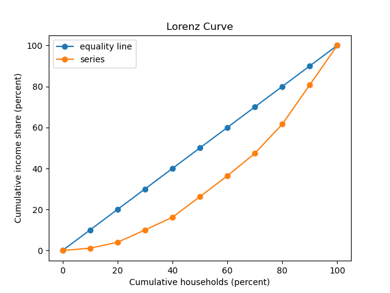

# ECON 102 Tools

This repo contains some helpful scripts I used while taking ECON102 (intro to macroeconomics) at Waterloo.

Some topics covered in these scripts:

- labour market dynamics
- economic index numbers
- income distribution and inequality
  - Gini coefficient and Lorenz curve

